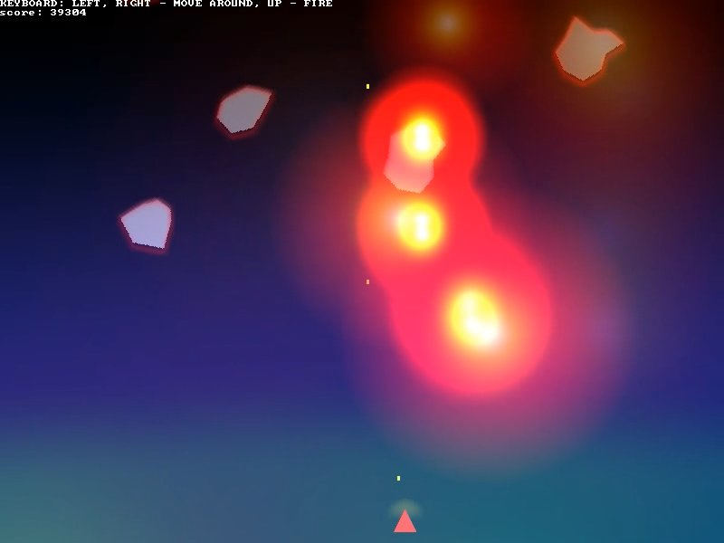

# Configurable items (config.json)
+ window_width (pixels)
+ window_height (pixels)
+ fps (number)
+ ship_shooting_freq (number / second)
+ ship_bullet_velocity (meters / second)
+ ship_forward_velocity (meters / second)
+ asteroid_angular_velocity_range (radians / second)
+ ship_thrust (newtons)
+ ship_mass (kilograms)
+ asteroid_appearance_frequency (number / second)
+ asteroid_appearance_frequency_increase (number / second)
+ asteroid_hitpoint_range (number)
+ projectile_hitpoint_range (number)

# Ship controls
+ UP - Fires the cannon.
+ LEFT, RIGHT - Accelerates respectively left- or rightwards.

# Leaving the vacuum
+ Press Esc
+ or Q

# Known issues
+ VFX artifacts were reported on NVIDIA drivers, however your humble game
 programmer has only a trusty ThinkPad X220 at his disposal.

# Building the game
## Software dependencies
+ liballegro5 (https://liballeg.org/)
+ json-c (https://github.com/json-c/json-c)

## On Linux
1. Install the software dependencies.
2. Use GNU Make (https://www.gnu.org/software/make/) to build the project.

## On Windows
1. Use Cygwin (https://www.cygwin.com/) to download dependencies.
2. Additionally, install the MinGW compiler suite and GNU Make using Cygwin.
3. Since Allegro 5 isn't packaged for Cygwin, you'll need to download a binary release.
4. From within a Cygwin shell, use GNU Make with Makefile.win to build the game.
